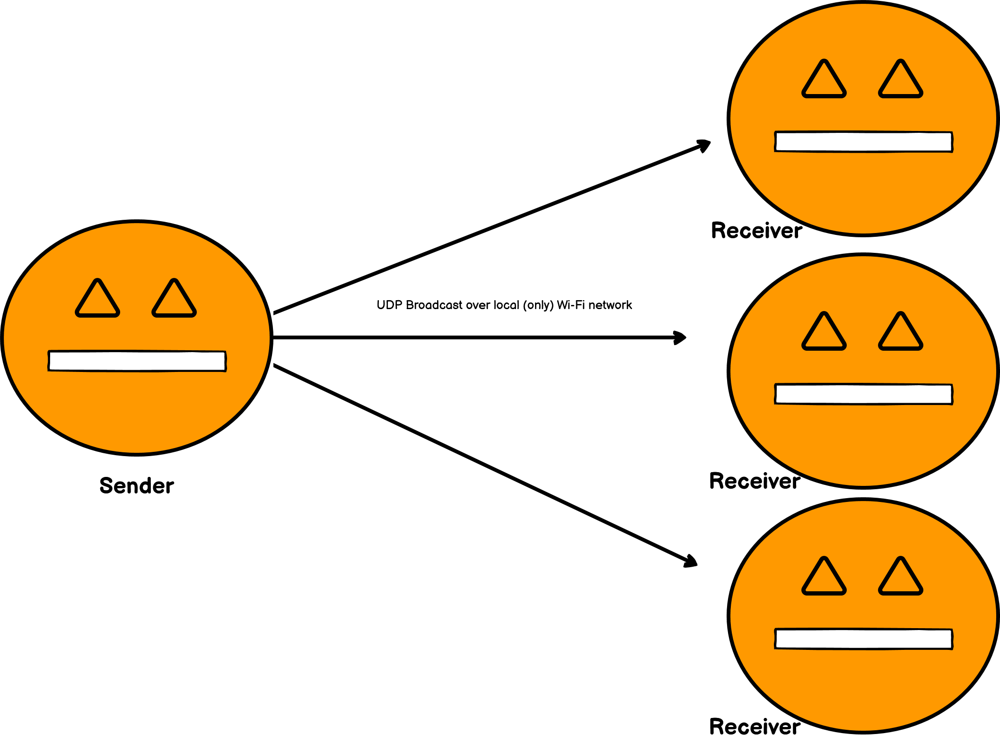
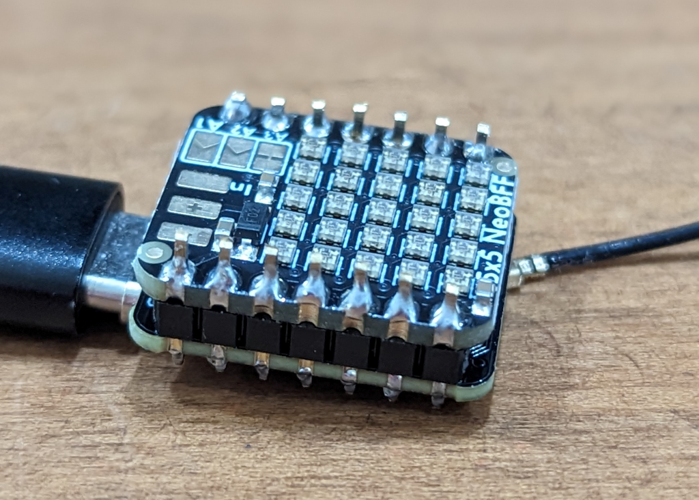

# Glowing Pumpkin Sync UDP

This is a version of the [Glowing Pumpkin Xiao 5x5 BFF](https://github.com/johnwargo/glowing-pumpkin-xiao-bff) project that allows multiple devices to synchronize LED Matrix colors so all devices display the same color. I built this project because I wanted to place one of the *Glowing Pumpkin Xiao 5x5 BFF* devices in each of the front dormers in my house and synchronize the display across all of them. 

Here is a video of the [project in action](https://www.youtube.com/watch?v=L2v5T3hO6S4).

The way it works is you deploy one of the devices with the [sender](https://github.com/johnwargo/glowing-pumpkin-udp-sync/tree/main/udp-sender-arduino) sketch and all of the remaining devices with the [receiver](https://github.com/johnwargo/glowing-pumpkin-udp-sync/tree/main/udp-receiver-arduino) sketch. As long as all of the devices are on the same Wi-Fi network segment, the sender sends an UDP broadcast message on the network notifying all of the other devices to switch to the same color. The sender sketch periodically a flicker broadcast and all devices flicker with white light like lightning or sparks. 

There are several folders in this repo; the following table describes the purpose of each:

| Folder                 | Description | 
| ---------------------- | ----------- |
| `udp-sender-arduino`   | Hosts the Arduino version of the Sender sketch. Configure and deploy this sketch on a single Glowing Pumpkin Xiao 5x5 BFF device. |
| `udp-receiver-arduino` | Hosts the **Receiver** sketch. Configure and deploy this sketch on all of the remaining Glowing Pumpkin Xiao 5x5 BFF devices used for this project. |
| `udp-sender-pi-pico-w` | I had a lot of trouble getting the `udp-sender-arduino` sketch working, so I decided try to get it working on another platform, in this case the Raspberry Pi Pico W, so I could exercise the Receiver running on multiple devices. As you can tell, I eventually got the Arduino Sender working, but left this version in the repo in case anyone wanted to play with it. I have some plans to enhance this one, but I have no idea when I'll get to it. | 

## Parts

For this project, I used the following hardware for both the Sender and Receiver devices:

* [Seeed Studio XIAO ESP32S3](https://www.seeedstudio.com/XIAO-ESP32S3-p-5627.html)
* [Adafruit 5x5 NeoPixel Grid BFF Add-On for QT Py and Xiao](https://www.adafruit.com/product/5646)

The Adafruit 5x5 board comes pre-configured to connect to pin A3 on the Xiao, but supports other options as well. Refer to the Adafruit documentation for details.

## Assembly

Assembling the device is super easy, you can solder the device back to back (which is pretty cool) or you can use headers to connect them together. I used male headers to connect the two boards together as shown in the following figure.

It took me a while to figure out how to orient the two devices when connecting them together. When you put them together back to back, with the USB connector for the Xiao board pointing up, the 5x5 board should be facing up as well, with the text at the bottom and the power pads (`+` and `-` pads) at the top as shown in the following figure.

## Configuring Network Settings

For both sketches and the Python code (Pi Pico version), The code reads Wi-Fi credentials and, for the Sender, other settings from a separate file. You must rename the confiuration file and populate it with the necessary settings for the code to function correctly. Refer to the readme files in each folder for details.

**Note:** Wi-Fi SSID and passwords are case sensitive, so if your device doesn't connect correctly to the network, double check the credentials.

## The Code

Normally I'd spend a lot of time here documenting everything I can tell you about the code. I'm not going to do that here because it's a lot of code to go through. I put a lot of comments in the code to help you understand what I did and why. If you have questions, ask them in an [issue](https://github.com/johnwargo/glowing-pumpkin-udp-sync/issues) in this repository and I'll answer when I can.

***

You can find information on many different topics on my [personal blog](http://www.johnwargo.com). Learn about all of my publications at [John Wargo Books](http://www.johnwargobooks.com).

If you find this code useful and feel like thanking me for providing it, please consider <a href="https://www.buymeacoffee.com/johnwargo" target="_blank">Buying Me a Coffee</a>, or making a purchase from [my Amazon Wish List](https://amzn.com/w/1WI6AAUKPT5P9).
